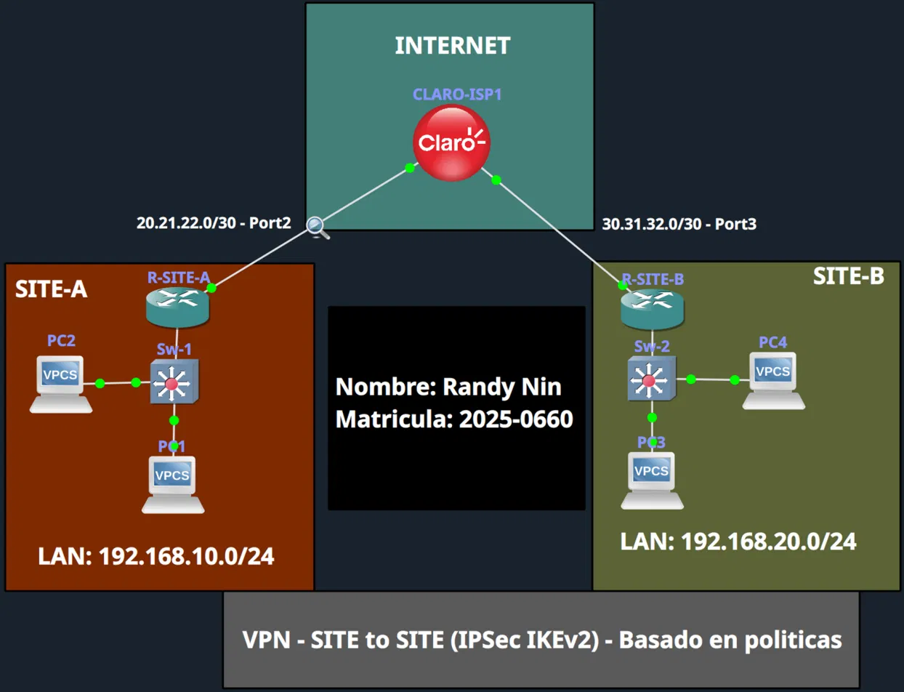
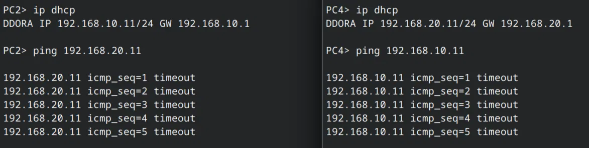
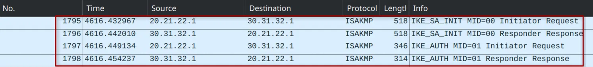
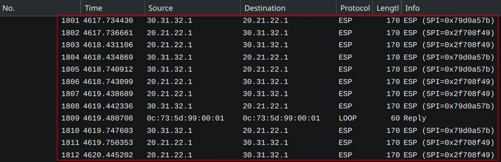
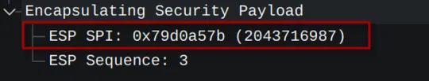
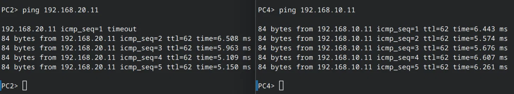
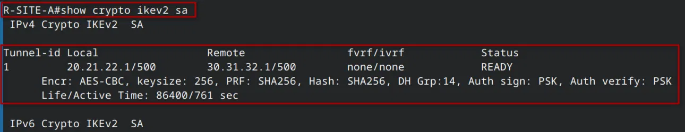
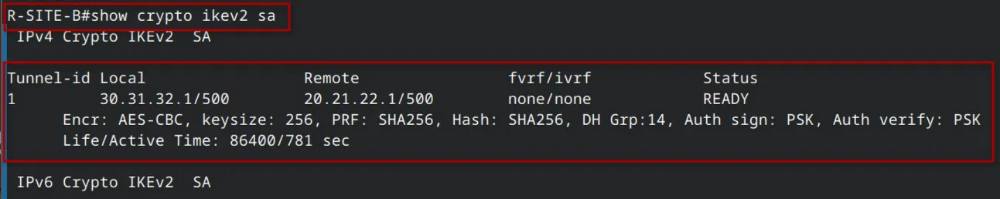
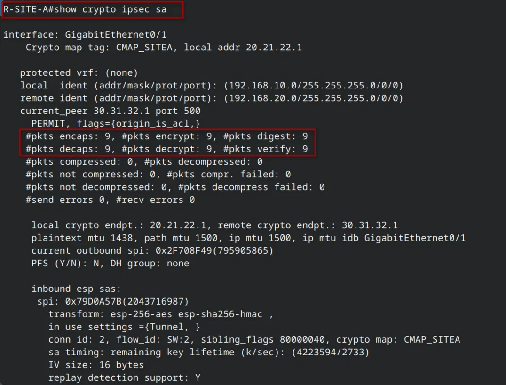
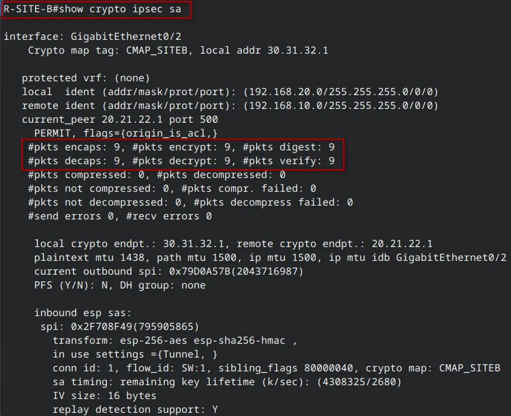

# SITE-SITE-IKEv2-POLICY-BASED

> **Autor:** Randy Nin **| Laboratorio de Redes | GNS3**

Implementación completa de una VPN Site-to-Site Policy-Based con IPSec IKEv2 sobre Cisco IOS. IKEv2 reemplaza la negociación de 9 mensajes de IKEv1 por un intercambio eficiente de solo 4 mensajes (2 IKE_SA_INIT + 2 IKE_AUTH) y estructura la configuración en componentes modulares: proposal, policy, keyring y profile. El tunnel protege el tráfico entre dos LANs con AES-256 y SHA-256.

---

## Contenido del repositorio

```
SITE-SITE-IKEv2-POLICY-BASED/
├── IMG/
│   ├── topology.png
│   ├── before-vpn-ping.png
│   ├── after-vpn-ping.png
│   ├── wireshark-ikev2.png
│   ├── wireshark-esp.png
│   ├── wireshark-esp-detail.png
│   ├── sitea-interface-brief.png
│   ├── siteb-interface-brief.png
│   ├── sitea-ikev2-sa.png
│   ├── siteb-ikev2-sa.png
│   ├── sitea-ipsec-sa.png
│   └── siteb-ipsec-sa.png
├── Policy-Based
├── Documentación Tecnica Profesional VPN Site-to-Site - IPSec IKEv2 - Policy-Based (Randy Nin -- 2025-0660).pdf
└── README.md
```

---

## Documentación técnica

La documentación técnica completa está disponible en:

**[Documentación Tecnica Profesional VPN Site-to-Site - IPSec IKEv2 - Policy-Based (Randy Nin -- 2025-0660).pdf](Documentación%20Tecnica%20Profesional%20VPN%20Site-to-Site%20-%20IPSec%20IKEv2%20-%20Policy-Based%20(Randy%20Nin%20--%202025-0660).pdf)**

---

## Topología



|Dispositivo|Interfaz|IP|Rol|
|:--|:--|:--|:--|
|CLARO-ISP|Gi0/1|20.21.22.2/30|Enlace hacia SITE-A|
|CLARO-ISP|Gi0/2|30.31.32.2/30|Enlace hacia SITE-B|
|R-SITE-A|Gi0/0|192.168.10.1/24|Gateway LAN SITE-A|
|R-SITE-A|Gi0/1|20.21.22.1/30|WAN / crypto map|
|R-SITE-B|Gi0/0|192.168.20.1/24|Gateway LAN SITE-B|
|R-SITE-B|Gi0/2|30.31.32.1/30|WAN / crypto map|

---

## Diferencia clave: IKEv2 vs IKEv1

|Aspecto|IKEv1|IKEv2 (este lab)|
|:--|:--|:--|
|Mensajes totales|9 (6+3)|**4 (2+2)**|
|Configuración|`crypto isakmp policy` + `crypto isakmp key`|**Proposal + Policy + Keyring + Profile**|
|Verificación|`show crypto isakmp sa` (QM_IDLE)|**`show crypto ikev2 sa` (READY)**|
|NAT-T / DPD|Extensiones opcionales|**Integrados nativamente**|

---

## Configuración VPN

El archivo de configuración completo está disponible en [`Policy-based`](https://claude.ai/chat/Policy-based). Bloques clave:

**IKEv2 proposal + policy + keyring + profile:**

```
crypto ikev2 proposal IKEv2_PROP
 encryption aes-cbc-256
 integrity sha256
 group 14

crypto ikev2 policy IKEv2_POL
 proposal IKEv2_PROP

crypto ikev2 keyring IKEv2_KEYRING
 peer SITE-B
  address 30.31.32.1
  pre-shared-key randy123

crypto ikev2 profile IKEv2_PROF
 match identity remote address 30.31.32.1
 authentication remote pre-share
 authentication local pre-share
 keyring local IKEv2_KEYRING
 lifetime 86400
```

**Transform-set + ACL + crypto map:**

```
crypto ipsec transform-set TRANF_SET esp-aes 256 esp-sha256-hmac
 mode tunnel

ip access-list extended VPN_to_SITEA
 permit ip 192.168.10.0 0.0.0.255 192.168.20.0 0.0.0.255

crypto map CMAP_SITEA 10 ipsec-isakmp
 set peer 30.31.32.1
 set ikev2-profile IKEv2_PROF
 set transform-set TRANF_SET
 set pfs group14
 match address VPN_to_SITEA

interface GigabitEthernet0/1
 crypto map CMAP_SITEA
```

---

## Antes de la VPN: sin conectividad



---

## Negociación IKEv2: solo 4 mensajes

La negociación completa se realiza en 4 mensajes frente a los 9 de IKEv1.



|Frame|Tipo|Dirección|
|:-:|:--|:--|
|1795|IKE_SA_INIT Initiator Request|R-SITE-A -> R-SITE-B|
|1796|IKE_SA_INIT Responder Response|R-SITE-B -> R-SITE-A|
|1797|IKE_AUTH Initiator Request|R-SITE-A -> R-SITE-B|
|1798|IKE_AUTH Responder Response|R-SITE-B -> R-SITE-A|

---

## Tráfico cifrado con ESP





---

## Conectividad establecida



---

## Verificación del tunnel

### show crypto ikev2 sa

Status READY: tunnel operacional (equivalente a QM_IDLE en IKEv1).

**R-SITE-A:**



**R-SITE-B:**



---

### show crypto ipsec sa

**R-SITE-A:**



**R-SITE-B:**



|Contador|R-SITE-A|R-SITE-B|
|:--|:-:|:-:|
|encaps / encrypt / digest|9 / 9 / 9|9 / 9 / 9|
|decaps / decrypt / verify|9 / 9 / 9|9 / 9 / 9|
|Outbound SPI|0x2F708F49|0x79D0A57B|
|Inbound SPI|0x79D0A57B|0x2F708F49|

---

## Video demostrativo

**LINK:** [https://youtu.be/8qX1oWza8Sg](https://youtu.be/8qX1oWza8Sg)

---

_Randy Nin / Matrícula 2025-0660_

---
